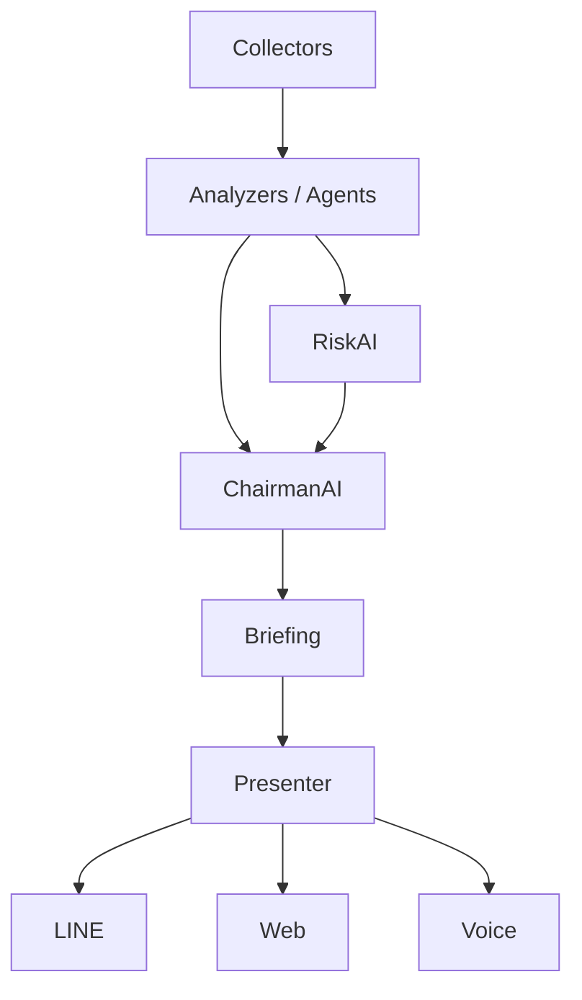

# AlphaOS Architecture

## Purpose
AlphaOS is an investment support system that keeps the UI simple while preserving evidence, reasons, and risk awareness.

## Current Direction
The current `briefing` module is the v1 orchestration layer. It should remain small, but it must be easy to split into clearer roles later.
The current MVP uses a JSON `/briefing` API and a simple HTML `/` presenter.
Risk and evidence logic now live in a small analyzer module so the orchestration layer can stay compact.
The current v2 step adds explicit collector and agent entry points without changing the public API.
The current v3 step adds JSONL history storage, weighted backtesting helpers, and period snapshots for learning.
The current API layer also exposes `/history`, `/history/view`, `/backtest`, `/outcome`, and `/learning` for reviewing stored briefings, recording outcomes, and scoring them against outcomes.
The current v4 step adds a multi-agent decision view and a historical replay simulation endpoint with in-window calibration, baseline comparison, and walk-forward validation.

## Target Layering

## Role Summary
- `collectors/`: fetch external data.
- `analyzers/`: derive signals and structured evidence.
- `agents/`: domain-specific AI workers such as NewsAI, MacroAI, RiskAI, and ChairmanAI.
- `agents/decision_ai.py`: combines MacroAI, NewsAI, TechnicalAI, CompanyAI, and RiskAI into one decision view.
- `briefing.py`: present a compact morning summary.
- `presenters/`: format the same briefing for LINE, Web, or future interfaces.
- `presenters/web.py`: current HTML presenter for the simple Web UI.
- `presenters/history.py`: current HTML presenter for the history view.
- `simulation/replay.py`: historical replay and simulation helpers.
- `storage/news_history.py`: archived market news for replay.
- `collectors/briefing_inputs.py`: current collector orchestration for the briefing inputs.
- `agents/chairman_ai.py`: current top-level briefing coordinator.
- `agents/risk_ai.py`: current risk review step.
- `storage/briefing_history.py`: briefing history persistence.
- `storage/outcome_history.py`: outcome history persistence.
- `learning/backtest.py`: score and weighted backtest helpers.
- `learning/feedback.py`: learning summary helpers with period snapshots.

## Evidence First
AlphaOS should preserve evidence as structured objects, not only as final labels.
This makes later agent coordination, learning, and backtesting possible.

## Version Roadmap
- `v1`: Morning briefing, risk-first summary, simple API, simple Web UI.
- `v1.5`: Evidence and RiskAI refinement.
- `v2`: AI meeting / multi-agent coordination.
- `v3`: Learning loop, score tracking, weighted backtesting, and history review UI.
- `v4`: Decision AI with replayable historical simulation.
- `v4`: Decision AI with replayable historical simulation, calibrated for the replay window, and walk-forward validation.
