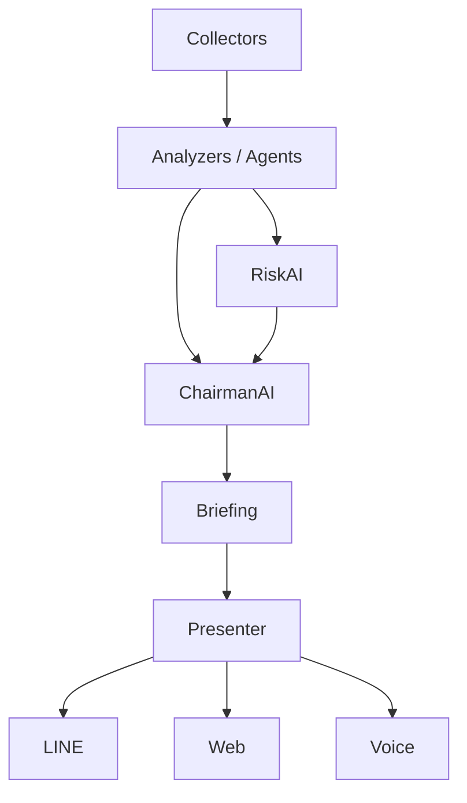

# AlphaOS Architecture

## Purpose
AlphaOS is an investment support system that keeps the UI simple while preserving evidence, reasons, and risk awareness.

## Current Direction
The current `briefing` module is the v1 orchestration layer. It should remain small, but it must be easy to split into clearer roles later.

## Target Layering

## Role Summary
- `collectors/`: fetch external data.
- `analyzers/`: derive signals and structured evidence.
- `agents/`: domain-specific AI workers such as NewsAI, MacroAI, RiskAI, and ChairmanAI.
- `briefing.py`: present a compact morning summary.
- `presenters/`: format the same briefing for LINE, Web, or future interfaces.

## Evidence First
AlphaOS should preserve evidence as structured objects, not only as final labels.
This makes later agent coordination, learning, and backtesting possible.

## Version Roadmap
- `v1`: Morning briefing, risk-first summary, simple API.
- `v1.5`: Evidence and RiskAI refinement.
- `v2`: AI meeting / multi-agent coordination.
- `v3`: Learning loop, score tracking, and backtesting.
