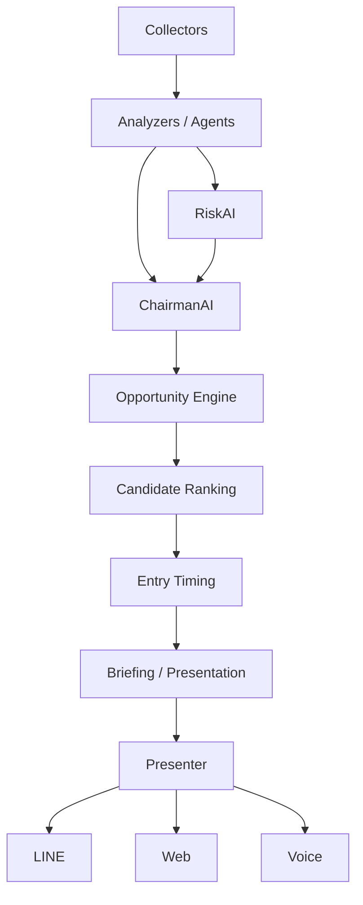

# AlphaOS Architecture

## Purpose
AlphaOS is an investment decision support system that keeps the UI simple while preserving evidence, reasons, risk awareness, and buy-candidate proposals.
Market summary remains a support view, but candidate proposals are the primary product direction.

## Current Direction
The current `briefing` module is the v1 orchestration layer. It should remain small, but it must be easy to split into clearer roles later.
The current MVP uses a JSON `/briefing` API and a simple HTML `/` presenter.
Risk and evidence logic now live in a small analyzer module so the orchestration layer can stay compact.
The current v2 step adds explicit collector and agent entry points without changing the public API.
The current v3 step adds JSONL history storage, weighted backtesting helpers, and period snapshots for learning.
The current API layer also exposes `/history`, `/history/view`, `/backtest`, `/outcome`, and `/learning` for reviewing stored briefings, recording outcomes, and scoring them against outcomes.
The live briefing and candidate routes can also accept an `interval` such as `1d` or `1m` so day-trade views can use minute-granularity inputs when available.
The current v4 step adds a multi-agent decision view and a historical replay simulation endpoint with in-window calibration, baseline comparison, and 500-sample walk-forward validation.
The next major layer is `Opportunity Engine`, which should translate decision output into ranked buy candidates, filter out weak or illiquid items, and provide entry timing hints.

## Target Layering

## Role Summary
- `collectors/`: fetch external data.
- `analyzers/`: derive signals and structured evidence.
- `agents/`: domain-specific AI workers such as NewsAI, MacroAI, RiskAI, and ChairmanAI.
- `agents/decision_ai.py`: combines MacroAI, NewsAI, TechnicalAI, CompanyAI, and RiskAI into one decision view.
- `agents/contracts.py`: shared AgentDecision contract for agent outputs.
- `briefing.py`: present a compact morning summary.
- `opportunity.py`: ranked buy-candidate proposal helpers, exclusion filters, and entry timing hints.
- `presenters/`: format the same briefing for LINE, Web, or future interfaces.
- `presenters/web.py`: current HTML presenter for the simple Web UI.
- `presenters/history.py`: current HTML presenter for the history view.
- `simulation/replay.py`: historical replay and simulation helpers.
- `simulation/validation.py`: virtual-trading validation for opportunity candidates.
- `simulation/what_if.py`: scenario impact helpers.
- `storage/news_history.py`: archived market news for replay.
- `knowledge_graph.py`: lightweight causal graph helpers.
- `personal.py`: profile-aware candidate filtering helpers.
- `collectors/briefing_inputs.py`: current collector orchestration for the briefing inputs.
- `agents/chairman_ai.py`: current top-level briefing coordinator.
- `agents/risk_ai.py`: current risk review step.
- `storage/briefing_history.py`: briefing history persistence.
- `storage/outcome_history.py`: outcome history persistence.
- `learning/backtest.py`: score and weighted backtest helpers.
- `learning/feedback.py`: learning summary helpers with period snapshots.
- `storage/market_memory.py`: market memory persistence and similar-case retrieval.

## Evidence First
AlphaOS should preserve evidence as structured objects, not only as final labels.
This makes later agent coordination, learning, and backtesting possible.

## Version Roadmap
- `v1`: Morning briefing, risk-first summary, simple API, simple Web UI.
- `v1.5`: Evidence and RiskAI refinement.
- `v2`: AI meeting / multi-agent coordination.
- `v3`: Learning loop, score tracking, weighted backtesting, and history review UI.
- `v4`: Decision AI with replayable historical simulation.
- `v4`: Decision AI with replayable historical simulation, calibrated for the replay window, 500-sample validation, and walk-forward validation.
- `v5`: Opportunity Engine with ranked buy candidates and entry timing.
- `v6`: Market Memory that helps candidate quality when it proves useful.
- `v7`: Learning loop that improves candidate ranking with real outcomes.
- `v8`: Knowledge Graph and personalization only if they improve candidate proposals.
## Interval-Aware Data Flow

- Live collection, replay, and validation now accept an `interval` argument.
- Default behavior remains daily (`1d`) to preserve `/briefing` compatibility.
- Minute granularity (`1m`) is used for daytrade-oriented checks without changing the main briefing contract.
- Candidate proposal and presentation layers consume the same collected source shape, regardless of interval.
